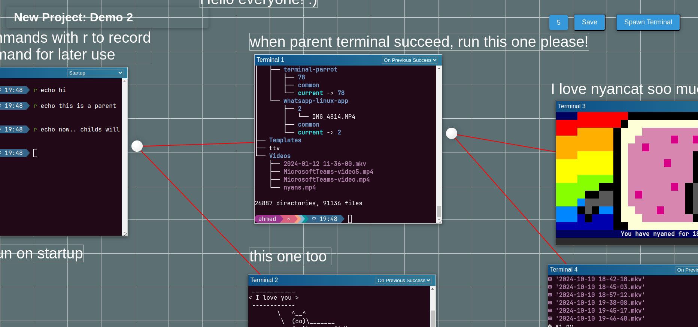

# Multi-Terminal Workflow Manager



### An interactive terminal-based workflow manager built with xterm.js and Express. Designed from hacker to hacker, it supports flexible, automated workflows for terminal operations with three powerful modes:

    1 Manual Mode: Execute commands manually.
    2 Startup Mode: Automatically run commands on page load.
    3 On Previous Success: Chain commands to run after a parent terminal succeeds.
    4 History Mode: just saves the history of the terminal.

## How to run?
1. ``` node http-server.js ```
2. go to http://127.0.0.1:3000/
3. spawn some terminals and nyan cats

## Key Features:
Visual connections between terminal instances.
Workflow automation for complex terminal tasks.
Save and load terminal sessions.
Supports interactive note-taking alongside terminal commands.
Want to customize something? Inspect the elements and make changes directly on the fly — all modifications are saved automatically!

## Tech Stack:

Frontend: xterm.js for terminal emulation, custom UI components.
Backend: Express.js for handling terminal processes and workflows.

<video controls src="flowT3.mp4" title="demo" style="width: 100%;"></video>

Built by hackers, for hackers.